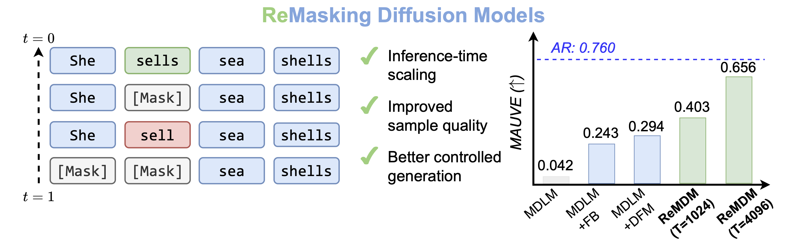

# Remasking Discrete Diffusion Models with Inference-Time Scaling

[](https://arxiv.org/abs/2503.00307)
[](https://remdm.github.io)
[](https://colab.research.google.com/drive/143sxeasXbmUIdROSXYQJLmSMIAhSZCPw?usp=sharing)



This is the codebase to reproduce the LLaDA results of ReMDM (Table 3 in the paper).


<a name="getting_started"></a>

## Getting started

To get started, create a conda environment:

```bash
conda create -n remdm-llada python=3.10
conda activate remdm-llada
pip install transformers==4.49.0 accelerate==0.34.2
pip install antlr4-python3-runtime==4.11 math_verify sympy hf_xet
```

Clone our forked version of `lm-eval` and install:
```bash
git clone --depth 1 https://github.com/guanghanwang/lm-evaluation-harness.git
cd lm-evaluation-harness
pip install -e .
```

Create the folders for storing outputs and log files:

```bash
mkdir outputs
mkdir logs
```

## Reproducing Experiments

Below, we demonstrate how to reproduce the benchmark results.

* Countdown
```bash
# LLaDA
bash scripts/countdown_llada.sh > ./logs/countdown_llada.log 2>&1
# LLaDA with ReMDM
bash scripts/countdown_llada_remdm.sh > ./logs/countdown_lladaremdm.log 2>&1
```

* TruthfulQA
```bash
# LLaDA
bash scripts/truthfulqa_llada.sh > ./logs/truthfulqa_llada.log 2>&1
# LLaDA with ReMDM
bash scripts/truthfulqa_llada_remdm.sh > ./logs/truthfulqa_lladaremdm.log 2>&1
```

### Acknowledgements
This repository was built off of [LLaDA](https://github.com/ML-GSAI/LLaDA).

## Citation
```
@article{wang2025remasking,
  title={Remasking Discrete Diffusion Models with Inference-Time Scaling},
  author={Wang, Guanghan and Schiff, Yair and Sahoo, Subham and Kuleshov, Volodymyr},
  journal={arXiv preprint arXiv:2503.00307},
  year={2025}
}
```